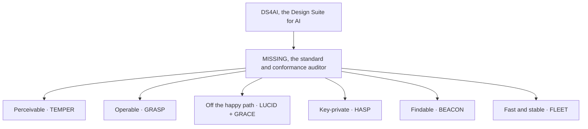

# MISSING

MISSING is the standard at the center of **DS4AI, the Design Suite for AI, from [Polymathie-Studio](https://github.com/Polymathie-Studio)**: the umbrella for the invisible-correctness layer of a shipped web surface, what a page must carry that a look-at-it review cannot see. AI-assisted builds optimize for "does it render, does the demo work," and skip everything not visible in the artifact under review. Every gap is an instance of that one thing. MISSING names the axes of that invisibility, routes each to the instrument that closes it, and ships the machine-readable pieces that let an agent or a build pipeline compose the suite and check a surface against it.

MISSING itself provides no UI component. It is the map, the family manifest, and the conformance auditor.



## Why MISSING

The name is literal. MISSING is about what is missing from a shipped web surface: the correctness that is present when the work is done right and conspicuously absent when it is not. Accessible controls, honest states, findable metadata, stable delivery, readable color, keys kept private, none of these are exotic, and they have been missing from a great deal of the web for a long time, well before AI wrote a line of it.

AI-assisted building and rendering make them missing more often, for the same reason at greater scale: a model optimizes for what the demo shows, and these are exactly the parts a demo does not show. So the name points in both directions, what the web has long left out and what an AI build leaves out faster, and MISSING answers it with a standard, a manifest, and an auditor, so a surface can be checked for what it is missing before it ships.

## The axes and their instruments

| Axis (kind of invisibility) | Posture | Instrument |
| --- | --- | --- |
| Invisible because color-coded | Perceivable by any reader | TEMPER |
| Invisible to a keyboard or assistive tech | Operable by any input or assistive technology | GRASP |
| Invisible until you interact or something fails | Behaves honestly off the happy path | LUCID (principle) + GRACE (components) |
| Invisible until inspected: keys in the client bundle | The user's key stays in the user's browser | HASP |
| Invisible until shared or crawled | Represents itself correctly to machines and shares | BEACON |
| Invisible until measured | Loads fast and stable | FLEET |

## The machine-readable core

MISSING ships its instructions machine-readable, not only as prose, so a tool or agent consumes them directly.

- **`manifest.json`** is the canonical descriptor of the family: every primitive's axis, package, exports, API, the conformance checks it exposes, and the packaging that lets it land on the common distribution surfaces (npm, JSR, CDN, and more).
- **`manifest.schema.json`** is a portable JSON Schema (draft 2020-12); validate any manifest against it with your own tool.
- **`validate.ts`** validates the manifest against the schema with zero dependencies, so MISSING stays as dependency-free as the family it describes. Run: `deno run --allow-read validate.ts`.
- **`conformance.js`** audits a shipped surface's HTML across all six axes and returns a structured per-axis report. It is a breadth pass; for depth on findability and delivery it points to the primitive's own auditor.

```js
import { audit } from './conformance.js'

const report = audit(serverHtmlString)
if (!report.ok) console.error(report.axes)
```

Following the family's honesty principle, the auditor declares the axes it cannot judge from a static snapshot rather than reporting them clean: the off-happy-path states are not visible in a single happy-path render, and full contrast needs rendered colors, so those come back marked `not checked` and `partial` with the reason.

## What MISSING does not close

MISSING names these as real gaps and routes them to "yours to handle" rather than claiming family coverage: observability (error tracking, uptime); backend security and scale; responsive layout (a discipline, not a component); legal content; and the delivery levers a drop-in primitive cannot pull (image compression, JavaScript bundling, and setting cache headers, which are build-tool and server work).

## Status

The machine-readable core (manifest, schema, validator, conformance auditor), the standard document (`MISSING - the standard.md`, dual-licensed CC-BY-4.0), and the cross-tool agent-instruction file (`AGENTS.md`) are all here. A cumulative MCP server for the whole suite is a later step, once every primitive is complete.

## License

Apache-2.0. Copyright 2026 Regis Lloyd Chapman. See `LICENSE` and `NOTICE`. The standard document (`MISSING - the standard.md`) is dual-licensed CC-BY-4.0; see `LICENSE-SPEC`.
